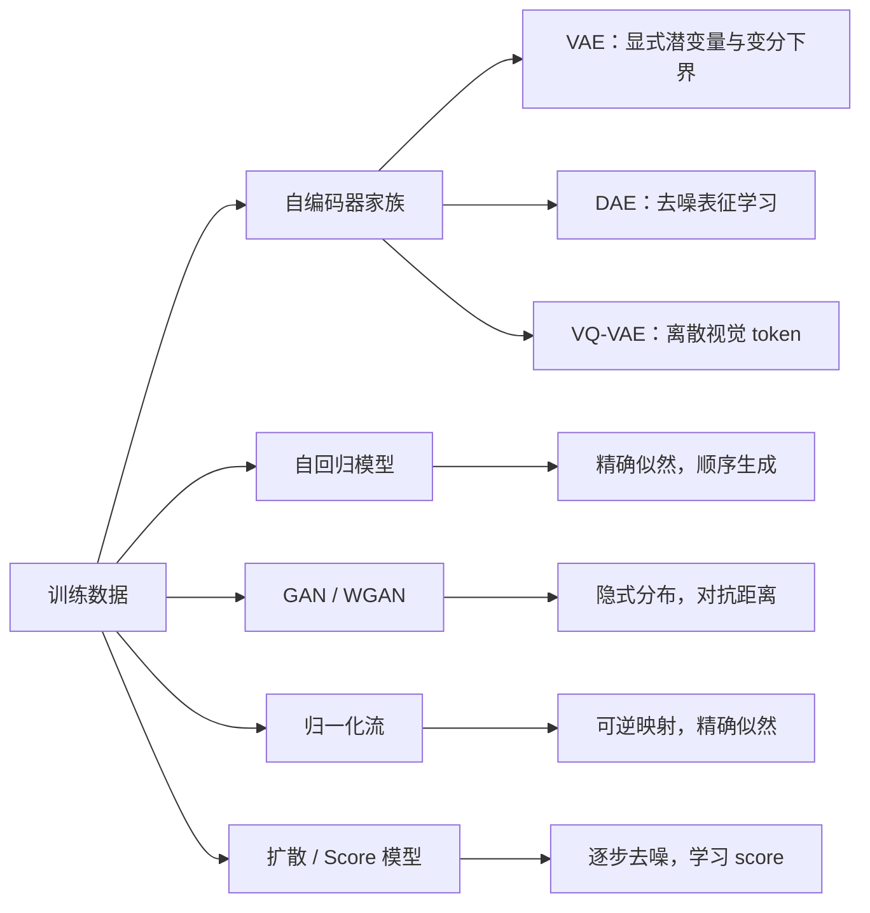

# 生成模型基础：中文课程笔记

本仓库将目录中的 7 份 PDF 课件整理为中文 Markdown。笔记按课件分章，合并了动画逐步展开造成的重复页，删除了课程宣传、联系方式、版权提示、日程与装饰页；公式、例题、算法、实现注意点和模型局限均尽量保留。关键架构使用 Mermaid 或少量课件原图辅助理解。

## 章节索引

| 章 | 主题 | 主要内容 |
|---|---|---|
| [01](notes/01-生成模型导论.md) | 生成模型导论 | 生成目标、高维分布、课程模型谱系 |
| [03](notes/03-自编码器与VAE.md) | 自编码器、VAE、DAE、VQ-VAE | 表示学习、ELBO、重参数化、离散潜变量 |
| [04](notes/04-Transformer.md) | Transformer | 自注意力、多头注意力、FFN、归一化、位置编码 |
| [05](notes/05-自回归模型.md) | 自回归模型 | 链式分解、语言模型、因果掩码、训练与解码 |
| [06](notes/06-GAN与WGAN.md) | GAN 与 WGAN | f-散度、JS、对抗训练、Wasserstein 距离、梯度惩罚 |
| [10](notes/10-归一化流.md) | 归一化流 | 变量替换、可逆网络、耦合层、残差流、连续流 |
| [11](notes/11-扩散模型.md) | 扩散模型 | DDPM、ELBO、噪声预测、score、SDE |

## 全局模型谱系

## 阅读约定

- $x$ 表示数据，$z$ 表示潜变量或基础噪声，$\theta,\phi$ 表示可学习参数。
- 文中“课件页”均按 PDF 的 1 起始页码计数；图片来源与页码见 [SOURCES.md](SOURCES.md)。
- 课件中的少量显然排版错误已按标准公式订正，并在相应章节注明。
