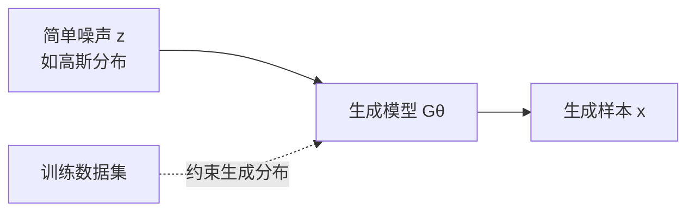

# 第 01 章　生成模型导论

## 1. 什么是生成建模

生成模型学习训练数据背后的概率规律，并据此产生新的样本。直观流程是：从容易采样的噪声出发，经神经网络变换后得到“看起来像训练数据”的样本。



“生成得好”有两个层次：

- 数学上，生成样本来自与训练数据相同或足够接近的分布；
- 实践上，样本应当逼真、有多样性，并对目标任务有用。

因此，生成建模不是逐个记忆训练样本，而是估计或模拟高维数据分布 $p_{\text{data}}(x)$。

## 2. 从一维随机变量到高维数据

一维分布容易描述。例如：

- $X\sim\mathrm{Uniform}(0,1)$：
  $$
  \mathbb E[X]=\frac12,\qquad \mathrm{Var}(X)=\frac1{12}.
  $$
- $X\sim\mathcal N(0,1)$：
  $$
  \mathbb E[X]=0,\qquad \mathrm{Var}(X)=1.
  $$

但真实数据通常维数极高：一张 $600\times600$ 的 RGB 图像已有 $1{,}080{,}000$ 个标量；一个长度为数百、词表为 $32768$ 的文本序列则是巨大的离散组合空间。变量之间还存在复杂依赖，例如图像的空间结构、文本的语法与长程语义。直接写出联合分布、计算期望或从中采样都很困难。

## 3. 本课程中的主要路线

```mermaid
flowchart TD
    P[目标：学习或逼近 p_data(x)] --> L[显式密度/似然]
    P --> I[隐式生成/分布匹配]
    P --> LAT[潜变量模型]
    L --> AR[自回归模型<br/>链式分解]
    L --> NF[归一化流<br/>可逆变量替换]
    I --> GAN[GAN / WGAN<br/>对抗式距离估计]
    LAT --> VAE[VAE<br/>变分下界]
    LAT --> DIFF[扩散模型<br/>多步潜变量与去噪]
```

- **自编码器家族**：先学习低维或离散表示；VAE 通过概率潜变量获得生成能力，DAE 通过去噪获得自监督表征，VQ-VAE 将连续视觉特征量化成 token。
- **自回归模型**：用概率链式法则把联合分布拆成一系列条件分布，似然精确但生成必须按顺序进行。
- **GAN/WGAN**：不显式计算密度，而用判别器或 critic 衡量真实分布与生成分布的差异。
- **归一化流**：以可逆变换连接简单分布和数据分布，可精确计算似然。
- **扩散模型**：正向逐步加噪，反向学习逐步去噪；与 score matching 和随机微分方程统一。

## 4. 学习时应持续追问的问题

对任何生成模型，都可以从以下维度比较：

1. 分布是显式的还是隐式的？能否计算 $p_\theta(x)$？
2. 训练目标是什么：最大似然、变分下界、分布距离，还是 score matching？
3. 采样是一步完成、顺序生成，还是多步迭代？
4. 模型的结构约束是什么：瓶颈、因果性、可逆性、Lipschitz 条件或噪声日程？
5. 主要代价落在训练、似然计算还是采样阶段？
