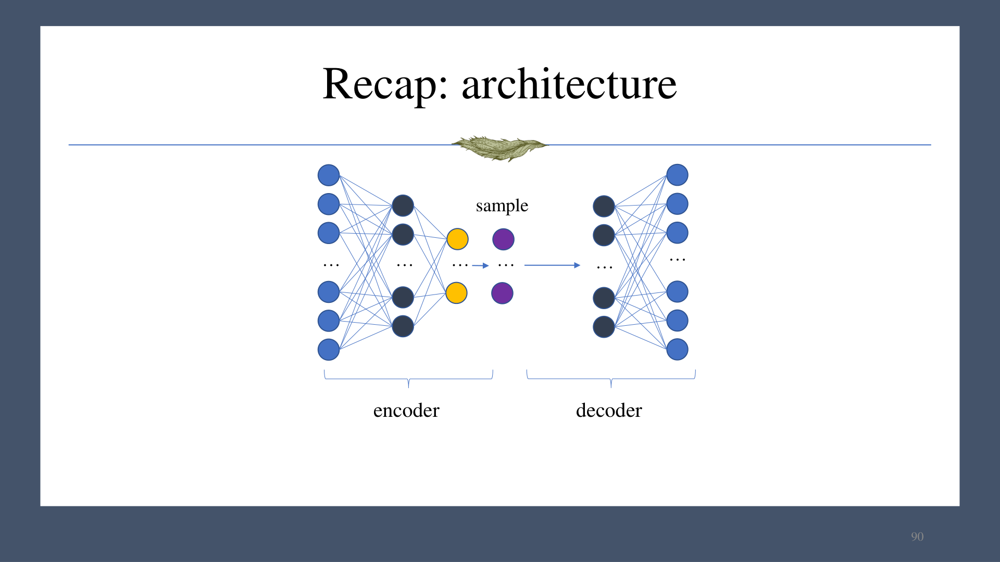
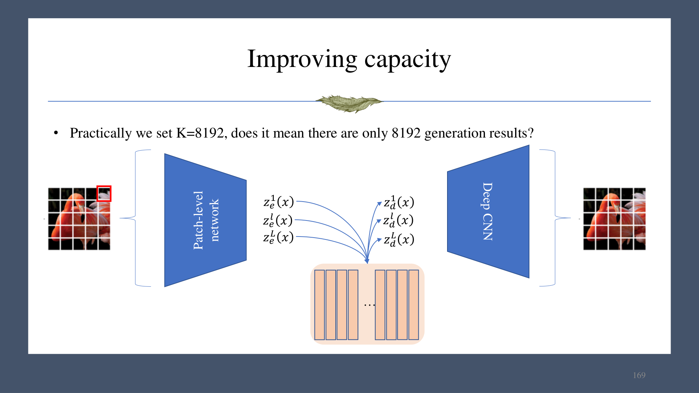
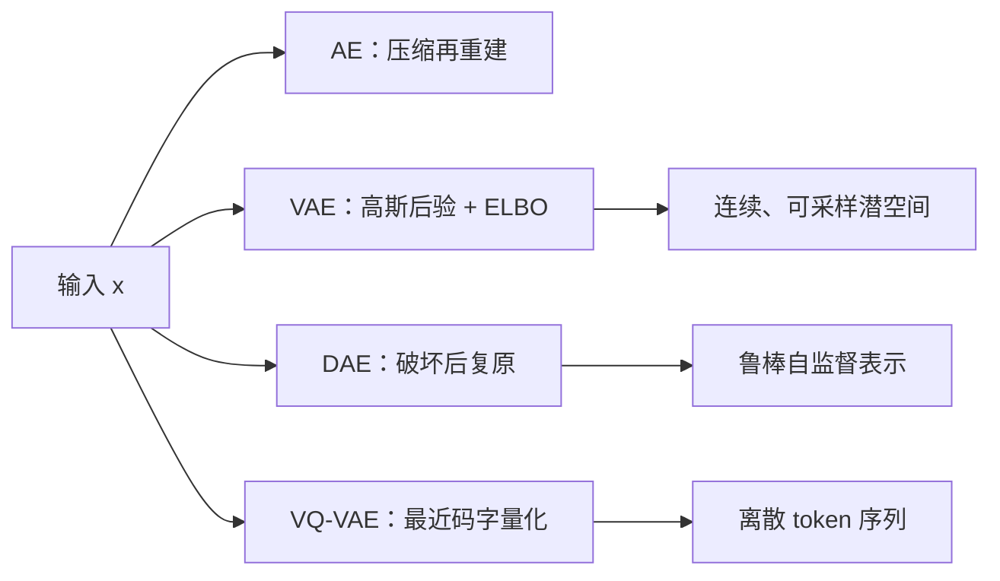

# 第 03 章　自编码器、VAE、DAE 与 VQ-VAE

## 1. 自编码器（Autoencoder）

自编码器由编码器 $g$ 和解码器 $f$ 组成：

$$
h=g(x),\qquad \hat x=f(h),\qquad f(g(x))\approx x.
$$

若网络容量不受限制，它可能直接学习恒等映射。为迫使模型抽取结构，通常令潜表示 $h$ 经过低维瓶颈，或加入噪声、稀疏性等约束。自编码器可用于可视化、压缩、无监督表示学习和预训练。

### 1.1 线性自编码器与 PCA

设数据 $x\in\mathbb R^d$，潜维度 $k\ll d$：

$$
h=Ux,\qquad \hat x=Vh=VUx,
$$

其中 $U\in\mathbb R^{k\times d}$，$V\in\mathbb R^{d\times k}$。训练目标为

$$
\min_{U,V}\lVert VUX-X\rVert_F^2.
$$

该分解存在尺度/基变换不唯一性：对任意可逆矩阵 $A$，$(AU,A^{-1}V)$ 给出同一乘积。在线性、平方误差和秩约束下，最优子空间与 PCA 的主子空间一致，并可由闭式特征分解求得。

### 1.2 为什么普通自编码器不是生成模型

普通自编码器只保证训练样本能编码再重建，并未规定潜变量 $h=g(x)$ 的整体分布。随机取一个 $h$ 往往落在训练编码未覆盖的区域，解码结果不可控。因此，若要生成，还需要为潜空间指定可采样的分布并让编码分布与之对齐。

## 2. 变分自编码器（VAE）

VAE 把编码器改为近似后验 $q_\phi(z\mid x)$，把解码器解释为似然 $p_\theta(x\mid z)$，并指定简单先验 $p(z)=\mathcal N(0,I)$。常用对角高斯编码器：

$$
q_\phi(z\mid x)=\mathcal N\!\left(z;\mu_\phi(x),\mathrm{diag}(\sigma_\phi^2(x))\right).
$$

以课件中的 MNIST 示例为例，输入为 $28\times28=784$ 维，隐藏层可取 256 维，编码器输出 50 个均值和 50 个方差参数。编码器与解码器不必镜像，也不局限于 MLP。

### 2.1 重参数化技巧

直接写 $z\sim q_\phi(z\mid x)$ 会把随机采样节点置于从损失到编码器参数的梯度路径上。将随机性移到与参数无关的噪声：

$$
\epsilon\sim\mathcal N(0,I),\qquad
z=\mu_\phi(x)+\sigma_\phi(x)\odot\epsilon.
$$

此时 $z$ 对 $\mu_\phi,\sigma_\phi$ 可微，可以用普通反向传播优化编码器。实践中网络常输出 $\log\sigma^2$，以保证方差为正并改善数值稳定性。

### 2.2 从边缘似然到 ELBO

生成模型为

$$
p_\theta(x)=\int p_\theta(x\mid z)p(z)\,dz,
$$

该积分通常不可解。引入 $q_\phi(z\mid x)$ 后：

$$
\begin{aligned}
\log p_\theta(x)
&=\mathcal L_{\text{ELBO}}(x)
+D_{\mathrm{KL}}\!\left(q_\phi(z\mid x)\,\|\,p_\theta(z\mid x)\right),\\
\mathcal L_{\text{ELBO}}(x)
&=\mathbb E_{q_\phi(z\mid x)}[\log p_\theta(x\mid z)]
-D_{\mathrm{KL}}\!\left(q_\phi(z\mid x)\,\|\,p(z)\right).
\end{aligned}
$$

KL 非负，因此 ELBO 是 $log p_\theta(x)$ 的下界。最大化 ELBO 等价于同时：

- 提高重建项，使 $z$ 能解释 $x$；
- 减小后验与先验的 KL，使潜空间连续、可从先验采样。

对角高斯到标准正态的 KL 有闭式：

$$
D_{\mathrm{KL}}(q_\phi(z\mid x)\|\mathcal N(0,I))
=\frac12\sum_j\left(\mu_j^2+\sigma_j^2-\log\sigma_j^2-1\right).
$$

若把重建项写成均方误差，一个常见最小化形式为

$$
\mathcal L_{\text{VAE}}
=\mathcal L_{\text{rec}}(x,\hat x)
+\lambda D_{\mathrm{KL}}(q_\phi(z\mid x)\|p(z)).
$$

$\lambda$ 调节重建质量与潜空间规则性。训练后生成时不需要编码器：采样 $z\sim\mathcal N(0,I)$，再由 $p_\theta(x\mid z)$ 解码。

### 2.3 局限

- 深层 VAE 的优化较难；
- 潜维度和 KL 权重较敏感；
- 优化的是似然下界，而非直接精确计算边缘似然；
- 实际系统中常作为更大生成管线的表示或压缩组件。

## 3. 去噪自编码器（DAE）

DAE 先从干净样本 $x$ 构造受损输入 $\tilde x\sim c(\tilde x\mid x)$，再学习还原 $x$：

$$
\min_\theta\;\mathbb E_{x,\tilde x}\bigl[\ell(f_\theta(\tilde x),x)\bigr].
$$

因为输入与目标不同，恒等映射不再是零损失捷径。破坏方式可以是遮蔽、删除或加性噪声；结构上不一定显式分成编码器和解码器。BERT 的掩码语言建模和 MAE 的图像块遮蔽都属于这一思想。它适合大规模自监督预训练与缺失内容恢复，但通常不单独称为完整的生成模型。

## 4. 向量量化 VAE（VQ-VAE）

VQ-VAE 用有限码本把连续视觉特征变为离散 token。设编码器输出 $z_e(x)$，码本为

$$
\mathcal E=\{e_k\}_{k=1}^{K}.
$$

对每个空间位置选择最近码字：

$$
k^{\ast}=\arg\min_k\lVert z_e(x)-e_k\rVert_2,
\qquad z_q(x)=e_{k^{\ast}}.
$$

> 课件文字提取中该处出现 `argmax`，结合“nearest code”和标准 VQ-VAE 定义，应为上式的 `argmin`。

最近邻选择不可微。直通估计器写成

$$
z_{\text{st}}=z_e+\mathrm{sg}(z_q-z_e),
$$

其中 $\mathrm{sg}$ 表示停止梯度。前向数值等于 $z_q$，反向对 $z_e$ 的导数视为恒等映射。

典型损失为

$$
\mathcal L
=\underbrace{\lVert x-D(z_q)\rVert_2^2}_{\text{重建}}
+\underbrace{\lVert\mathrm{sg}[z_e]-e\rVert_2^2}_{\text{更新码本}}
+\underbrace{\beta\lVert z_e-\mathrm{sg}[e]\rVert_2^2}_{\text{commitment}}.
$$

最后一项防止编码器输出任意漂移，迫使其靠近所选码字。

码本大小 $K=8192$ 并不意味着只能生成 8192 种图像。图像被编码为长度 $L$ 的 token 序列，理论组合数为 $K^L$；后续可再用自回归模型或其他先验学习这些离散序列的分布。

## 5. 小结

