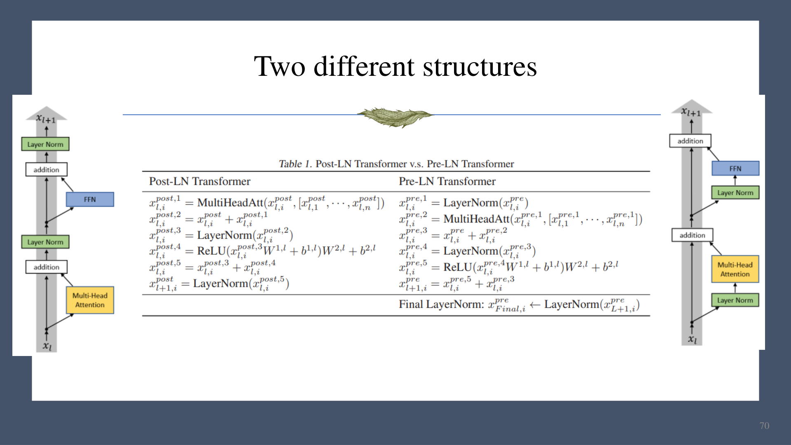
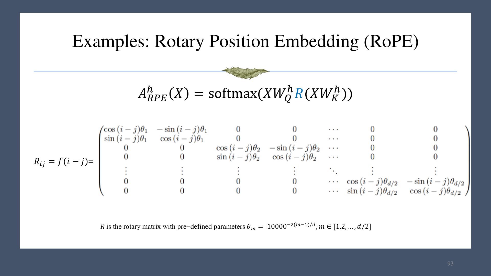
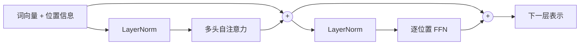

# 第 04 章　Transformer

Transformer 的核心目标是：让每个位置根据当前输入，选择性聚合其他位置的信息。与固定窗口或循环递归相比，自注意力可以直接建立长距离依赖，并在训练时并行处理序列。

## 1. 自注意力

给定序列表示 $X\in\mathbb R^{n\times d}$，线性投影得到

$$
Q=XW_Q,\qquad K=XW_K,\qquad V=XW_V.
$$

单个位置 $i$ 的查询、键和值为

$$
q_i=x_iW_Q,\quad k_i=x_iW_K,\quad v_i=x_iW_V.
$$

缩放点积注意力：

$$
e_{ij}=\frac{q_i k_j^\top}{\sqrt{d_k}},\qquad
\alpha_{ij}=\frac{\exp(e_{ij})}{\sum_{l=1}^n\exp(e_{il})},\qquad
z_i=\sum_{j=1}^n\alpha_{ij}v_j.
$$

矩阵形式：

$$
\mathrm{Attention}(Q,K,V)
=\mathrm{softmax}\!\left(\frac{QK^\top}{\sqrt{d_k}}\right)V.
$$

### 为什么除以 $\sqrt{d_k}$

若 $q_i,k_j$ 的各维独立、均值为 0、方差为 1，则

$$
\mathrm{Var}(q_i k_j^\top)
=\mathrm{Var}\!\left(\sum_{r=1}^{d_k}q_{ir}k_{jr}\right)=d_k.
$$

维数增大时，未缩放的 logits 会变大，使 softmax 过度饱和、梯度变小。除以 $\sqrt{d_k}$ 后方差恢复到约 1。

## 2. 多头注意力与掩码

多头注意力在不同子空间独立计算注意力：

$$
\mathrm{head}_h
=\mathrm{Attention}(XW_Q^h,XW_K^h,XW_V^h),
$$

$$
\mathrm{MHA}(X)
=\mathrm{Concat}(\mathrm{head}_1,\ldots,\mathrm{head}_H)W_O.
$$

不同头可学习不同依赖模式。实现时通常将头维并入 batch，以批量矩阵乘法计算 $QK^\top$，在 softmax 前加入掩码：

- 布尔掩码：被遮挡位置填 $-\infty$；
- 加性掩码：直接把 $0/-\infty$ 矩阵加到 logits；
- padding mask：屏蔽填充 token；
- causal mask：屏蔽未来 token。

然后沿键的维度做 softmax、可选 dropout，再与 $V$ 相乘，恢复多头形状并做输出投影。注意力的非线性主要来自 softmax。

## 3. 前馈网络、残差与层归一化

注意力负责“收集/组织信息”，位置前馈网络负责逐位置加工：

$$
\mathrm{FFN}(z_i)=W_2\,\sigma(W_1z_i+b_1)+b_2,
$$

其中隐藏层通常比模型维度宽，激活函数常用 GeLU。每个位置共享同一组 FFN 参数，但彼此独立计算。

残差连接为

$$
x_{l+1}=x_l+f_l(x_l),
$$

使深层网络保留恒等路径。LayerNorm 对每个样本、每个序列位置的 embedding 维做归一化：

$$
\mathrm{LN}(x)
=\gamma\odot\frac{x-\mu}{\sqrt{\sigma^2+\epsilon}}+\beta.
$$

### Post-LN 与 Pre-LN

$$
\text{Post-LN: }x\leftarrow\mathrm{LN}(x+\mathrm{Sublayer}(x)),
$$

$$
\text{Pre-LN: }x\leftarrow x+\mathrm{Sublayer}(\mathrm{LN}(x)).
$$

Pre-LN 通常在网络末端再做一次 LayerNorm。课件指出：Post-LN 的深层梯度更不均衡，对学习率和 warm-up 敏感；Pre-LN 的恒等残差通路使训练更稳定。

## 4. 位置编码

若没有位置信息，自注意力和逐位置 FFN 对 token 的置换是等变的，无法区分词序。因此需要显式注入位置。

### 4.1 绝对位置编码

最直接的做法是

$$
\tilde x_i=x_i+p_i.
$$

$p_i$ 可以是固定正弦编码或可学习向量。正弦编码的不同频率使位置间内积与相对偏移相关；可学习绝对位置简单有效，但通常难以外推到训练时未见的更长序列。投影矩阵也会改变原始正弦几何，因此“内积只依赖距离”的性质不能不加条件地延伸到注意力分数。

### 4.2 相对位置偏置

直接在注意力 logits 中加入仅依赖相对位置的偏置：

$$
e_{ij}=\frac{q_i k_j^\top}{\sqrt{d_k}}+b_{ij},
\qquad b_{ij}=f(i-j).
$$

T5 等模型会把距离分桶后学习偏置，远距离可共享参数。

### 4.3 RoPE（旋转位置编码）

RoPE 把第 $m$ 个二维子空间旋转与位置成比例的角度。定义

$$
R(i,\theta_m)=
\begin{bmatrix}
\cos(i\theta_m)&-\sin(i\theta_m)\\
\sin(i\theta_m)&\cos(i\theta_m)
\end{bmatrix},
\quad
\theta_m=10000^{-2(m-1)/d}.
$$

对 $q_i,k_j$ 分块旋转后，由旋转矩阵的性质

$$
(R_iq_i)^\top(R_jk_j)=q_i^\top R_{j-i}k_j,
$$

内积自然只依赖相对位移 $j-i$。

## 5. 编码器块的整体数据流

上图为 Pre-LN 版本。若用于自回归语言模型，MHA 还必须加入因果掩码；训练与推理细节见下一章。
