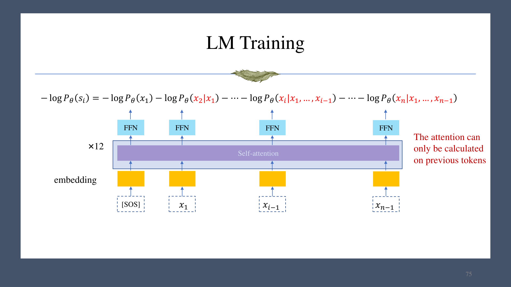
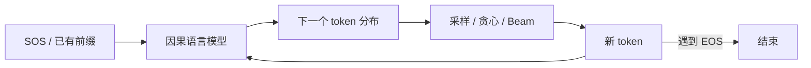

# 第 05 章　自回归生成模型

## 1. 概率链式分解

对高维变量 $x=(x_1,\ldots,x_n)$，联合分布总能写成

$$
p(x)=\prod_{i=1}^{n}p(x_i\mid x_{<i}).
$$

图像中 $x_i$ 可表示按某种顺序排列的像素或通道，文本中 $x_i$ 是 token。分解顺序决定生成顺序：从起始条件出发，逐步预测并采样下一个变量。

## 2. 从 n-gram 到神经语言模型

语言模型估计下一个 token 的条件分布。n-gram 用 $k$ 阶 Markov 假设截断上下文：

$$
p(x_i\mid x_{<i})\approx p(x_i\mid x_{i-k:i-1}).
$$

计数估计示例：若语料中 “students opened their” 出现 100 次，后接 `books` 70 次、`laptops` 30 次，则

$$
p(\text{books}\mid\text{students opened their})=0.7,
\quad
p(\text{laptops}\mid\cdots)=0.3.
$$

较大的 $n$ 捕获更长上下文，但稀疏性和存储成本增加；较小的 $n$ 估计稳健，却忽略长程依赖。

固定窗口神经网络用 embedding 与 MLP 替代计数，缓解稀疏和存储问题，但上下文长度仍固定。RNN 递归更新状态：

$$
h_t=f_W(h_{t-1},x_t),\qquad
p(x_{t+1}\mid x_{\le t})=\mathrm{softmax}(W_oh_t).
$$

它能处理任意长度且参数量不随序列增长，但训练必须顺序展开，通过时间反向传播（BPTT）容易遇到长依赖优化问题，硬件并行度也低。

## 3. 最大似然训练

若训练集中的句子独立，最大似然等价于最小化负对数似然：

$$
\mathcal L(\theta)
=-\sum_{s\in\mathcal D}\log p_\theta(s)
=-\sum_{s\in\mathcal D}\sum_{i=1}^{|s|}
\log p_\theta(x_i\mid x_{<i}).
$$

序列通常加入 `[SOS]` 和 `[EOS]`。训练采用 **teacher forcing**：位置 $i$ 的输入前缀来自真实序列，而不是模型前一步的采样，因此所有位置的损失可以并行计算。

## 4. Transformer 解码器与因果掩码

Transformer 训练时同时输入整个目标序列，但位置 $i$ 不能看到 $i$ 之后的 token。因果掩码 $M$ 为

$$
M_{ij}=\begin{cases}
0,&j\le i,\\
-\infty,&j>i.
\end{cases}
$$

注意力变为

$$
\mathrm{softmax}\!\left(\frac{QK^\top}{\sqrt{d_k}}+M\right)V.
$$

若不加掩码，模型可以直接从未来位置读取答案，形成“复制”捷径：训练/验证损失可能异常低，但真正从左到右生成时表现极差。

## 5. 大规模训练注意点

- **混合精度**：结合 FP32、FP16 或 BF16 降低显存和提高吞吐；不同算子对精度的敏感性不同。
- **大 token batch**：课件示例为 (512\times2048\approx10^6) token/批；显存不足时用梯度累积模拟大批量。
- **优化稳定性**：常用较小 dropout、学习率 warm-up 和梯度裁剪。
- **数据规模**：课件给出的训练规模跨度约从 $3.4$B 到 $4$T token，说明模型与数据扩展需要成套的计算和数据工程。

课件中的具体 GPU 代际与精度支持属于当时硬件示例，不应视为跨平台恒定规则。

## 6. 评估

对序列 $s=(x_1,\ldots,x_n)$：

$$
\mathrm{NLL}(s)=-\log p_\theta(s)
=-\sum_{i=1}^n\log p_\theta(x_i\mid x_{<i}),
$$

$$
\overline{\mathrm{NLL}}(s)=-\frac1n\log p_\theta(s),
\qquad
\mathrm{PPL}(s)=\exp\bigl(\overline{\mathrm{NLL}}(s)\bigr).
$$

困惑度越低表示模型平均赋给正确 token 的概率越高。对开放式生成，还可用 BLEU、ROUGE 等与参考文本比较，但它们不能完整衡量事实性、语义质量和多样性。

## 7. 推理解码

给定当前条件分布 $p_\theta(x_t\mid x_{<t})$，常见策略如下：

| 策略 | 选择方式 | 速度 | 多样性 | 课件中的准确性倾向 |
|---|---|---:|---:|---:|
| 随机采样 | 按完整分布采样 | 快 | 高 | 较低 |
| Top-k | 仅保留概率最高的 $k$ 个候选 | 快 | 中高 | 较高 |
| 贪心 | 每步取 $\arg\max$ | 快 | 低 | 较高 |
| Beam search | 保留若干累计分数最高的前缀 | 较慢 | 中等 | 高 |

课件把 Top-k 示例写成“在前 $k$ 项中均匀抽样”；更常见实现是截断后按归一化的模型概率抽样。二者都限制候选集合，但随机权重不同。

Beam search 在每步扩展所有保留前缀，并按累计对数概率剪枝；它并不保证找到全局最优序列，beam 越大计算和内存越高。

## 8. 复杂度

对序列长 $n$、模型维度 $d$：

- Q/K/V 线性投影：$O(nd^2)$；
- $QK^\top$：$O(n^2d)$；
- softmax：$O(n^2)$；
- 权重乘 $V$：$O(n^2d)$。

若把 $d$ 视为常数，注意力的序列复杂度为 $O(n^2)$。Transformer 训练虽为二次计算，却能并行；RNN 的序列操作数近似线性，却必须逐步执行。

推理时，RNN 可缓存单个隐藏状态，总步数近似 $O(n)$。朴素 Transformer 每生成一个 token 都重算完整前缀，按课件的简化分析为 $O(n^2)$；实际系统用 KV cache 复用旧键和值，可避免重复投影，但每个新 token 仍需与已有上下文做注意力。

