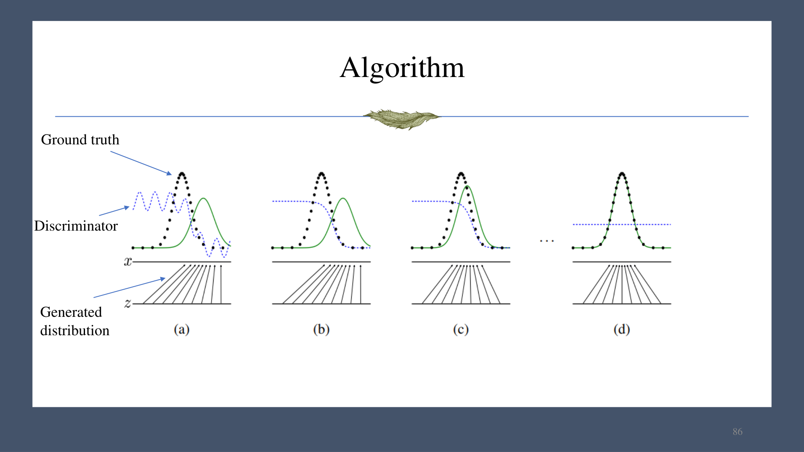
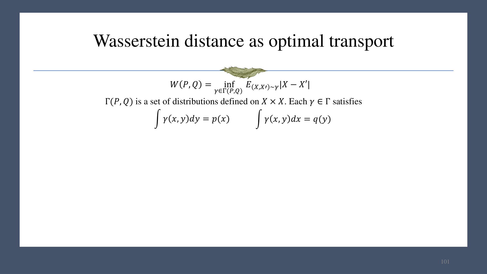
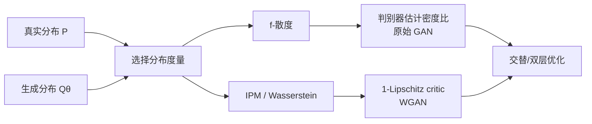

# 第 06 章　GAN 与 WGAN

## 1. 隐式生成与逆变换采样

一维情形下，若分布的累积分布函数为 $F$，取

$$
U\sim\operatorname{Uniform}(0,1),\qquad X=F^{-1}(U),
$$

则

$$
\Pr(X<t)=\Pr(U<F(t))=F(t),
$$

故 $X$ 服从目标分布。高维复杂数据难以直接构造 $F^{-1}$，GAN 用神经网络 $G_\theta$ 学习从简单噪声到数据的映射：

$$
z\sim p(z),\qquad x=G_\theta(z).
$$

此时可采样，却通常无法显式计算 $p_\theta(x)$，所以称为隐式生成模型。显式模型可以评估密度并进行标准最大似然训练；隐式模型需要通过样本来比较分布。

## 2. 分布距离：f-散度

对凸函数 $f$ 且 $f(1)=0$，定义

$$
D_f(P\|Q)=\int q(x)f\!\left(\frac{p(x)}{q(x)}\right)dx
=\mathbb E_{x\sim Q}\left[f\!\left(\frac{p(x)}{q(x)}\right)\right].
$$

由 Jensen 不等式：

$$
D_f(P\|Q)\ge
f\!\left(\mathbb E_Q\frac{p(x)}{q(x)}\right)
=f(1)=0.
$$

常见实例：

- $f(t)=t\log t$：$D_{\mathrm{KL}}(P\|Q)$；
- $f(t)=\frac12|t-1|$：总变差距离；
- Jensen-Shannon 散度：令 $M=(P+Q)/2$，
  $$
  D_{\mathrm{JS}}(P\|Q)=\tfrac12D_{\mathrm{KL}}(P\|M)
  +\tfrac12D_{\mathrm{KL}}(Q\|M).
  $$

不同资料可能把 JS 的 $1/2$ 因子吸收到定义中，数值缩放不同但优化结论不变。

## 3. 原始 GAN

判别器 $D(x)\in(0,1)$ 估计样本来自真实数据的概率。原始目标为

$$
\min_G\max_D V(D,G)
=\mathbb E_{x\sim p_{\text{data}}}\log D(x)
+\mathbb E_{z\sim p(z)}\log\bigl(1-D(G(z))\bigr).
$$

固定 $G$ 后，对每个 $x$ 的最优判别器满足

$$
D^*(x)=\frac{p_{\text{data}}(x)}{p_{\text{data}}(x)+p_g(x)}.
$$

代回可得目标与 $D_{\mathrm{JS}}(p_{\text{data}}\|p_g)$ 相差常数，因此理想的内层判别器把生成器训练转化为最小化 JS 散度。

### 3.1 交替训练

1. 从真实数据采样 $x$，从先验采样 $z$，得到假样本 $G(z)$；
2. 固定 $G$，更新 $D$ 以区分真/假；
3. 固定 $D$，更新 $G$ 以欺骗判别器；
4. 重复上述双层优化。

训练困难来自非凸—非凹的博弈：判别器和生成器能力需要匹配，超参数敏感，还可能发生 **mode collapse**，即多个噪声输入映射到少量模式，样本看似逼真却缺乏覆盖度。

## 4. 积分概率度量与 Wasserstein 距离

积分概率度量（IPM）用函数类 $\mathcal F$ 比较两个分布：

$$
D_{\mathcal F}(P,Q)
=\sup_{f\in\mathcal F}\left|\mathbb E_P[f(x)]-\mathbb E_Q[f(x)]\right|.
$$

Wasserstein-1 距离的原始形式是最优运输问题：

$$
W_1(P,Q)=\inf_{\gamma\in\Pi(P,Q)}
\mathbb E_{(X,Y)\sim\gamma}[\lVert X-Y\rVert],
$$

其中 $\Pi(P,Q)$ 是边缘分别为 $P,Q$ 的所有联合分布。它表示把一堆“土”从 $P$ 搬到 $Q$ 的最小平均运输成本。

Kantorovich-Rubinstein 对偶给出

$$
W_1(P,Q)=\sup_{\lVert f\rVert_L\le1}
\left(\mathbb E_{x\sim P}f(x)-\mathbb E_{x\sim Q}f(x)\right),
$$

其中 $f$ 是 1-Lipschitz 函数。这使距离可以由神经网络近似。

## 5. WGAN

WGAN 的 critic $f_w$ 输出任意实数，不再是二分类概率：

$$
\min_G\max_{f_w\in\mathrm{Lip}_1}
\left[
\mathbb E_{x\sim p_{\text{data}}}f_w(x)
-\mathbb E_{z\sim p(z)}f_w(G(z))
\right].
$$

### 5.1 权重裁剪

早期 WGAN 把 critic 参数裁剪到有限区间。它能给 Lipschitz 常数一个有限上界，但不能精确保证常数为 1；过度裁剪会降低网络容量并造成优化问题。

### 5.2 梯度惩罚（WGAN-GP）

可微的 1-Lipschitz 函数满足 $\lVert\nabla_x f(x)\rVert_2\le1$。WGAN-GP 在真实和生成样本间的插值点 $\hat x$ 上加入

$$
\lambda\,\mathbb E_{\hat x}
\left(\lVert\nabla_{\hat x}f_w(\hat x)\rVert_2-1\right)^2.
$$

若把 critic 写成最大化目标，应减去该惩罚；若把训练写成最小化损失，则加上惩罚。插值点常取

$$
\hat x=\epsilon x+(1-\epsilon)\tilde x,
\quad \epsilon\sim\operatorname{Uniform}(0,1),
$$

其中 $x$ 为真实样本，$\tilde x=G(z)$ 为生成样本。

## 6. 统一理解与应用

课件还展示了对抗思想的延伸：对抗攻击通过输入扰动改变预测；领域自适应通过对抗判别对齐源域和目标域表示；无监督词对齐用对抗目标匹配不同语言的嵌入分布。共同点都是：用一个可学习判别目标近似难以直接计算的分布差异。
