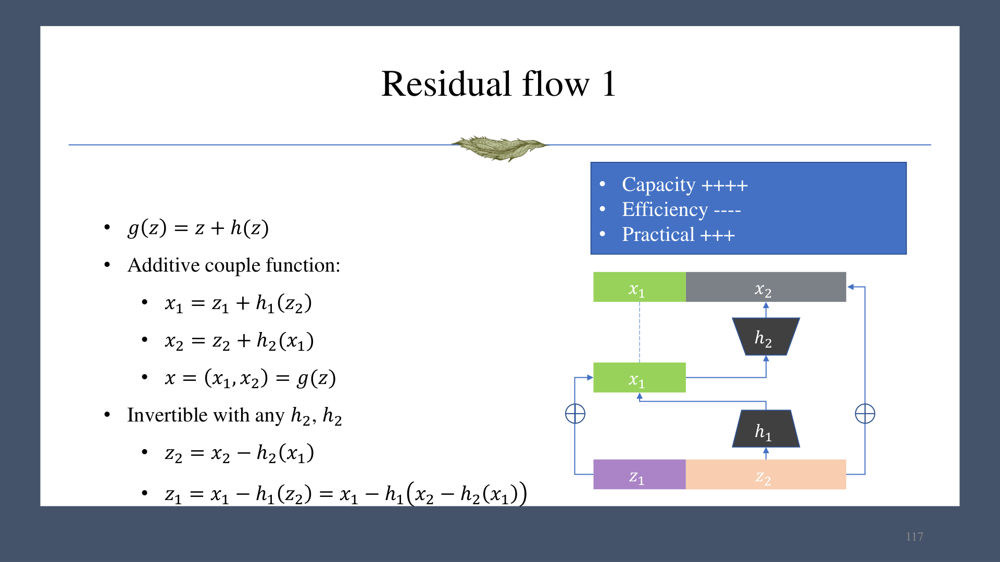
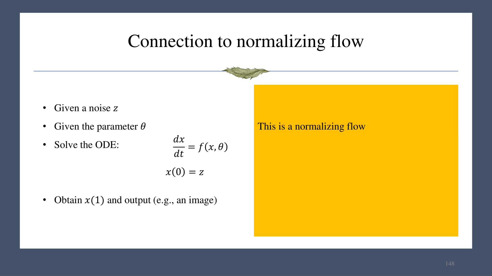
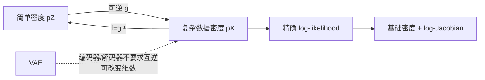

# 第 10 章　归一化流（Normalizing Flow）

归一化流用可逆映射把简单基础分布变成复杂数据分布，同时借助变量替换公式精确计算密度。它兼具非序列生成与最大似然训练，但对网络结构施加了可逆性和 Jacobian 行列式可计算的约束。

## 1. 一维变量替换

令 $z\sim p_Z$，$x=g_\theta(z)$，且 $g$ 可逆、可微。概率质量守恒：

$$
p_X(x)=p_Z(g^{-1}(x))\left|\frac{d g^{-1}(x)}{dx}\right|
=\frac{p_Z(z)}{|g'(z)|}.
$$

例：$z\sim\operatorname{Uniform}(0,1)$，$x=2z$。则 $x\sim\operatorname{Uniform}(0,2)$，密度为 $1/2$：映射把区间长度放大 2 倍，密度相应缩小 2 倍。

## 2. 高维变量替换

设 $g:\mathbb R^d\to\mathbb R^d$ 是微分同胚，$f=g^{-1}$。则

$$
p_X(x)=p_Z(f(x))\left|\det J_f(x)\right|,
$$

$$
\log p_X(x)=\log p_Z(z)+\log\left|\det J_f(x)\right|,
\quad z=f(x).
$$

行列式绝对值表示局部体积的缩放比。训练时最小化负对数似然：

$$
\mathcal L_{\text{NLL}}
=-\sum_{x\in\mathcal D}\left[
\log p_Z(f_\theta(x))+
\log|\det J_{f_\theta}(x)|
\right].
$$

- $g:z\to x$ 是 **generating direction**；
- $f:x\to z$ 是 **normalizing direction**。

做密度估计时希望 $f$ 和其 log-determinant 便宜；做采样时希望 $g$ 便宜。如果逆变换代价不对称，参数化方向要按任务选择。

归一化流可用于精确似然、采样，以及用低似然做异常/新颖性检测；但似然与人类感知异常不总一致，使用时需谨慎。

## 3. 复合可逆变换

把简单层串联：

$$
g=g_N\circ g_{N-1}\circ\cdots\circ g_1.
$$

逆变换按反序执行：

$$
g^{-1}=g_1^{-1}\circ g_2^{-1}\circ\cdots\circ g_N^{-1}.
$$

链式法则使 log-determinant 可加：

$$
\log|\det J_g|
=\sum_{i=1}^N\log|\det J_{g_i}|.
$$

因此设计目标是：每层既有表达力，又能快速正向、快速求逆、快速算 log-determinant。

## 4. 基本可逆层

### 4.1 逐元素单调变换

对每一维独立应用可逆单调函数，Jacobian 为对角阵，行列式容易计算；但维度间不交互，表达力有限。

### 4.2 线性变换

$$
x=Az+b,\qquad z=A^{-1}(x-b),\qquad
\log|\det J_g|=\log|\det A|.
$$

一般稠密矩阵求逆/行列式约为 $O(d^3)$。若 $A$ 为非零对角的三角阵，行列式是对角线乘积，求解约 $O(d^2)$。正交矩阵满足 $A^{-1}=A^\top$、$|\det A|=1$，但训练中维持正交约束较难，可用 Householder 变换等参数化。课件写“det=1”，严格地说正交矩阵行列式可为 $+1$ 或 $-1$，绝对值恒为 1。

线性层与逐元素非线性层交替，形式类似 MLP；容量增加，但可逆性与计算效率会限制可选激活和参数化。

## 5. 加性耦合层

把 $z=(z_1,z_2)$ 分块：

$$
x_1=z_1+h_1(z_2),\qquad
x_2=z_2+h_2(x_1).
$$

逆变换可以显式按反序求：

$$
z_2=x_2-h_2(x_1),\qquad
z_1=x_1-h_1(z_2).
$$

即使 $h_1,h_2$ 本身不可逆，整体变换仍可逆。每个子步骤的 Jacobian 为三角阵且对角线全 1，因此行列式为 1；通过交替分块、置换或加入尺度项，可让不同维度充分交互并改变体积。

## 6. 残差流

残差映射

$$
g(z)=z+h(z)
$$

在 $\operatorname{Lip}(h)<1$ 时可逆。若存在 $z_1\ne z_2$ 但 $g(z_1)=g(z_2)$，则

$$
z_1-z_2=h(z_2)-h(z_1),
$$

从而

$$
\frac{\|h(z_2)-h(z_1)\|}{\|z_2-z_1\|}=1,
$$

与 Lipschitz 常数小于 1 矛盾。逆可通过不动点迭代求解，但一般 log-determinant 的计算仍较昂贵。残差流容量高，效率相对较低。

## 7. 连续归一化流（CNF）

把有限层极限写成常微分方程：

$$
\frac{dx(t)}{dt}=f_\theta(x(t),t),\qquad x(0)=z,
$$

积分到 $t=1$ 得到 $x(1)$。若向量场满足适当连续性和局部 Lipschitz 条件，Picard-Lindelöf 定理保证解局部存在且唯一；轨迹不能相交，因此时间演化给出可逆流，反向积分即可求逆。

反例说明唯一性条件必要。初值问题

$$
\frac{dx}{dt}=3x^{2/3},\qquad x(0)=0
$$

既可有恒零解，也可有在某时刻后沿三次曲线离开的解。

### 7.1 ODE 例题

$$
\frac{dx}{dt}=tx,\qquad x(0)=1.
$$

分离变量：

$$
\frac{dx}{x}=t\,dt
\Rightarrow \log x=\frac{t^2}{2}+C.
$$

由初值得 $C=0$，故

$$
x(t)=e^{t^2/2}.
$$

### 7.2 与 ResNet 的联系

Euler 离散化：

$$
x(t+\Delta t)=x(t)+\Delta t\,f_\theta(x(t),t).
$$

当 $\Delta t=1$ 时形式上就是残差块；连续流可视为“无限深、步长趋于零”的 ResNet。

## 8. 与其他模型的关系

与 VAE 相比，流的编码器与解码器严格互逆、输入输出维数相同，并给出精确似然；代价是结构自由度受可逆性和行列式计算约束。
