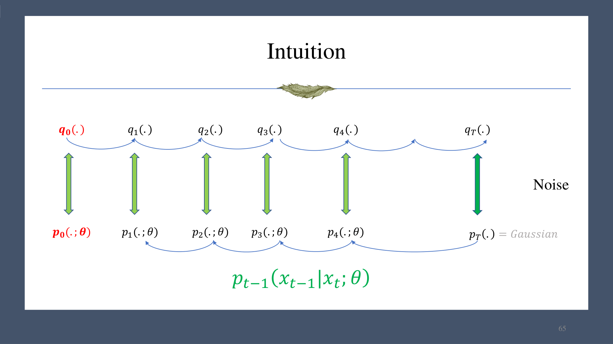
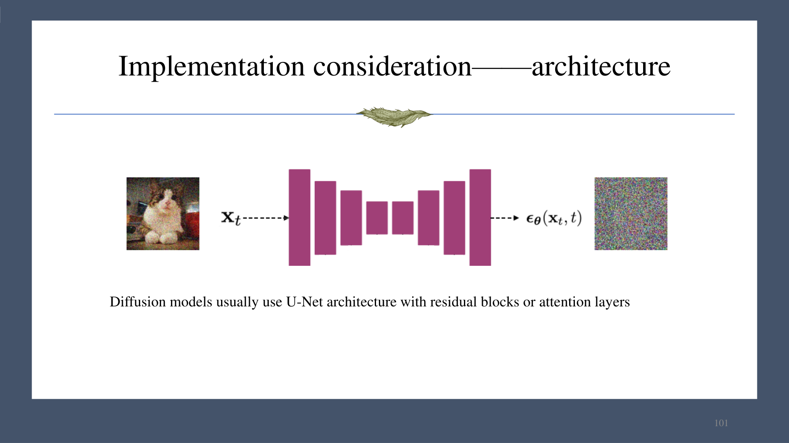
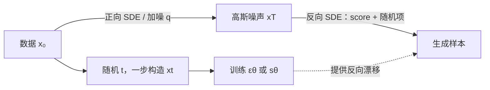

# 第 11 章　扩散模型、Score Matching 与 SDE

扩散模型把复杂数据逐步扰动为高斯噪声，再学习逆向去噪。正向过程固定，反向过程由神经网络参数化。

## 1. DDPM 的正向过程

设噪声日程 $0<\beta_t<1$，定义

$$
\alpha_t=1-\beta_t,
\qquad
\bar\alpha_t=\prod_{s=1}^{t}\alpha_s.
$$

正向 Markov 链：

$$
q(x_t\mid x_{t-1})
=\mathcal N(\sqrt{\alpha_t}x_{t-1},\beta_t I),
$$

等价重参数化为

$$
x_t=\sqrt{\alpha_t}x_{t-1}+\sqrt{\beta_t}\epsilon_t,
\quad \epsilon_t\sim\mathcal N(0,I).
$$

利用高斯的闭包性，可从 $x_0$ 一步采样任意时刻：

$$
q(x_t\mid x_0)
=\mathcal N(\sqrt{\bar\alpha_t}x_0,(1-\bar\alpha_t)I),
$$

$$
x_t=\sqrt{\bar\alpha_t}x_0
+\sqrt{1-\bar\alpha_t}\epsilon,
\quad \epsilon\sim\mathcal N(0,I).
$$

当 $\bar\alpha_T\to0$，终点 $q(x_T\mid x_0)$ 接近 $\mathcal N(0,I)$。这使训练无需真的逐步加噪到 $t$：随机采样一个 $t$ 后即可直接合成 $x_t$。

## 2. 反向生成过程

从 $x_T\sim\mathcal N(0,I)$ 出发，学习

$$
p_\theta(x_{t-1}\mid x_t)
=\mathcal N(\mu_\theta(x_t,t),\sigma_t^2I),
$$

并从 $t=T,T-1,\ldots,1$ 逐步采样。方差可固定为与噪声日程有关的值，也可以学习；神经网络主要预测均值、原图、噪声或它们的等价参数化。

## 3. 变分下界

把 $x_{1:T}$ 看成潜变量，负 ELBO 可分解为

$$
\begin{aligned}
\mathcal L_{\mathrm{VLB}}
=\mathbb E_q\bigg[&D_{\mathrm{KL}}(q(x_T\mid x_0)\|p(x_T))\\
&+\sum_{t=2}^{T}D_{\mathrm{KL}}\bigl(q(x_{t-1}\mid x_t,x_0)
\|p_\theta(x_{t-1}\mid x_t)\bigr)\\
&-\log p_\theta(x_0\mid x_1)\bigg].
\end{aligned}
$$

在固定正向日程时，终端 KL 通常与 $\theta$ 无关，可作为常数处理；最后一项是重建项，中间各项让反向高斯匹配可计算的真实后验。

### 3.1 正向后验

由高斯乘积：

$$
q(x_{t-1}\mid x_t,x_0)
=\mathcal N(\tilde\mu_t(x_t,x_0),\tilde\beta_t I),
$$

$$
\tilde\beta_t
=\frac{1-\bar\alpha_{t-1}}{1-\bar\alpha_t}\beta_t,
$$

$$
\tilde\mu_t
=\frac{\sqrt{\bar\alpha_{t-1}}\beta_t}{1-\bar\alpha_t}x_0
+\frac{\sqrt{\alpha_t}(1-\bar\alpha_{t-1})}{1-\bar\alpha_t}x_t.
$$

两个协方差固定的高斯之间的 KL 等价于带权均值平方误差，因此训练可化为回归问题。

## 4. 噪声预测参数化

用神经网络 $\epsilon_\theta(x_t,t)$ 预测构造 $x_t$ 时加入的噪声，并令

$$
\mu_\theta(x_t,t)
=\frac1{\sqrt{\alpha_t}}
\left(x_t-\frac{\beta_t}{\sqrt{1-\bar\alpha_t}}
\epsilon_\theta(x_t,t)\right).
$$

实践中常使用去掉理论权重后的简单损失：

$$
\mathcal L_{\mathrm{simple}}
=\mathbb E_{t,x_0,\epsilon}
\left[
\left\|\epsilon-
\epsilon_\theta\!\left(
\sqrt{\bar\alpha_t}x_0+
\sqrt{1-\bar\alpha_t}\epsilon,t
\right)\right\|_2^2
\right].
$$

训练算法：随机取数据 $x_0$、时间 $t$ 和高斯噪声 $\epsilon$，一步构造 $x_t$，让网络恢复 $\epsilon$。

## 5. 网络架构

图像扩散常用 U-Net：下采样路径提取多尺度特征，上采样路径恢复空间分辨率，并通过跳连传递细节；块内可含残差卷积和注意力。时间 $t$ 经正弦/可学习 embedding 和 MLP 后注入各层，使同一网络知道当前噪声水平。

课件也展示了以 Transformer 为主干的扩散模型，说明噪声预测器不必局限于卷积 U-Net；关键接口仍是输入 $x_t,t$，输出与 $x_t$ 同形状的预测量。

## 6. 与 score 的关系

条件高斯的 score 为

$$
\nabla_{x_t}\log q(x_t\mid x_0)
=-\frac{x_t-\sqrt{\bar\alpha_t}x_0}{1-\bar\alpha_t}
=-\frac{\epsilon}{\sqrt{1-\bar\alpha_t}}.
$$

因此预测噪声等价于预测不同噪声层级下的条件 score，只差一个已知比例：

$$
s_\theta(x_t,t)
\approx -\frac{\epsilon_\theta(x_t,t)}{\sqrt{1-\bar\alpha_t}}.
$$

去噪 score matching 目标可写为

$$
\mathbb E_t\mathbb E_{x_0}
\mathbb E_{x_t\sim q(x_t\mid x_0)}
\left\|s_\theta(x_t,t)-
\nabla_{x_t}\log q(x_t\mid x_0)\right\|_2^2.
$$

### 6.1 为什么条件 score 可学到边缘 score

令 $q_t(x_t)=\int q(x_0)q(x_t\mid x_0)dx_0$。目标展开后，与参数有关的交叉项满足

$$
\begin{aligned}
&\mathbb E_{x_0,x_t\mid x_0}
[s_\theta(x_t,t)^\top\nabla_{x_t}\log q(x_t\mid x_0)]\\
&=\int s_\theta(x_t,t)^\top
\nabla_{x_t}\left[\int q(x_0)q(x_t\mid x_0)dx_0\right]dx_t\\
&=\mathbb E_{x_t\sim q_t}
[s_\theta(x_t,t)^\top\nabla_{x_t}\log q_t(x_t)].
\end{aligned}
$$

所以条件去噪目标与直接拟合边缘 score 的目标只差与 $\theta$ 无关的常数，最优解相同。

## 7. 连续时间与随机微分方程

当步长趋于零，DDPM 对应 variance-preserving SDE：

$$
dx=-\frac12\beta(t)x\,dt+\sqrt{\beta(t)}\,dW_t.
$$

其反向时间 SDE 为

$$
dx=\left[-\frac12\beta(t)x
-\beta(t)\nabla_x\log q_t(x)\right]dt
+\sqrt{\beta(t)}\,d\bar W_t,
$$

其中从 $T$ 积分回 0 时 $dt<0$，$d\bar W_t$ 是反向时间 Brownian 增量。用 $s_\theta(x,t)$ 代替未知 score，即可数值求解并生成样本。

DDPM、噪声预测、去噪 score matching 和反向 SDE 是同一思想的离散与连续表述：学习各噪声尺度下指向高数据密度区域的向量场，再沿该向量场从噪声返回数据。
